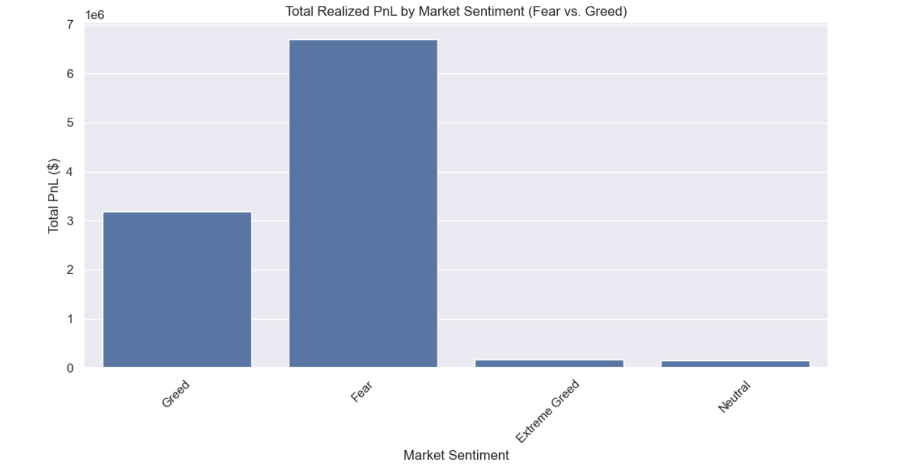
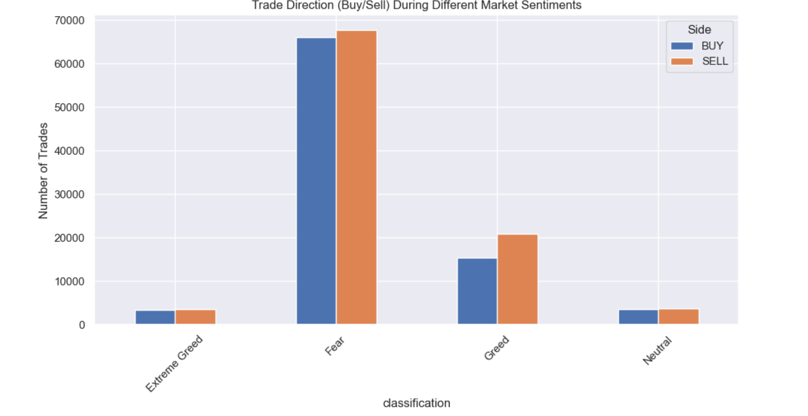
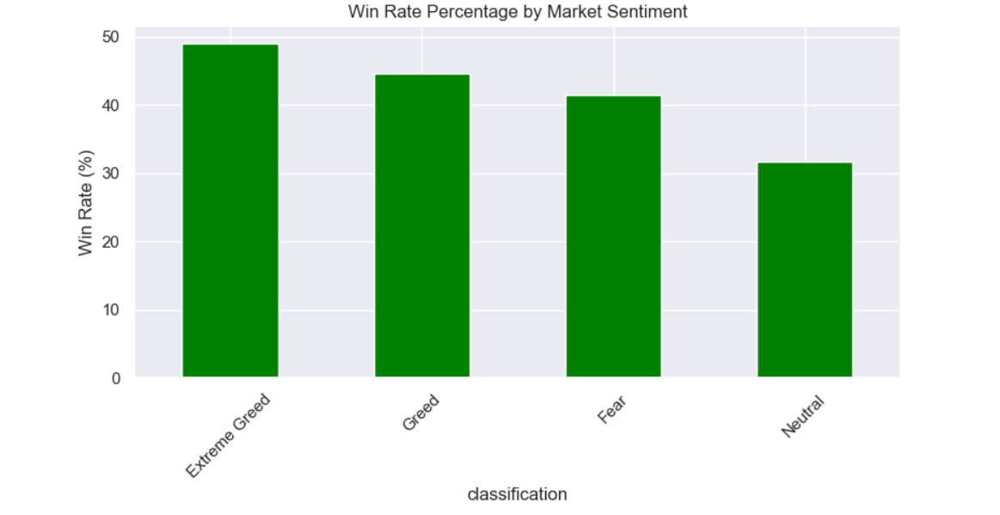

# Bitcoin Sentiment & Trader Performance Analysis 📈

## 🎯 Project Overview
This project explores the relationship between historical trader performance on Hyperliquid and the Bitcoin Fear & Greed Index. The objective is to uncover hidden behavioral patterns, analyze leverage usage during different market conditions, and deliver data-driven insights to inform smarter algorithmic trading strategies.

## 🛠️ Tech Stack & Requirements
This project was built using Python. To run the analysis, you will need the following libraries:
* `pandas` (Data manipulation and merging)
* `numpy` (Numerical operations)
* `matplotlib` (Static data visualization)
* `seaborn` (Advanced statistical plotting)

## 📂 Repository Structure
* `performTask.ipynb` : The main Jupyter Notebook containing the data pipeline, EDA, and insight generation.
* `README.md` : Project documentation.

* ## 💡 Key Findings & Strategic Insights

### 1. The Volatility and Profitability of "Fear"
Contrary to the assumption that traders perform best in bull markets, the data reveals that **Total Realized PnL peaks massively during market "Fear"** (surpassing $6.5M). This correlates directly with trade volume; the highest concentration of trading activity (both buying and selling) occurs during Fear states, indicating high volatility that active traders are successfully capitalizing on.


### 2. Trade Direction and Sell Pressure
During periods of high volume (Fear and Greed), there is consistently a higher ratio of Sell orders compared to Buy orders. Interestingly, during "Fear", the volume of Buys still remains incredibly high (approx. 65,000 trades), suggesting strong "buy the dip" behavior alongside panic selling.


### 3. The "Extreme Greed" Win Rate Anomaly
While overall PnL and volume are highest during Fear, the actual **Win Rate (percentage of profitable trades) peaks during "Extreme Greed" at nearly 49%**. However, because total volume is lowest during this sentiment, it suggests that while traders are highly accurate during Extreme Greed, they are trading much less frequently, perhaps waiting for clear trend confirmations.


### Strategic Recommendation
Algorithms should be tuned to increase trade frequency and widen volatility bands during "Fear" sentiments to capture the massive PnL opportunities present in the data. Conversely, during "Extreme Greed," algorithms should lower frequency but increase position sizes on high-probability setups, as the win rate is statistically at its highest.

## 🚀 How to Run the Analysis
1. Ensure both CSV datasets are located in the same root directory as the Jupyter Notebook.
2. Install the required dependencies:
   ```bash
   pip install pandas numpy matplotlib seaborn
